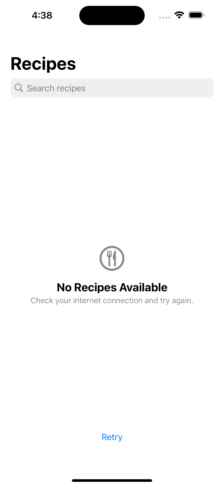

# FetchRecipes
Take Home Project for Fetch

### Summary: Include screen shots or a video of your app highlighting its features

  
  
  
  
  

### Focus Areas: What specific areas of the project did you prioritize? Why did you choose to focus on these areas?

### Time Spent: Approximately how long did you spend working on this project? How did you allocate your time?

### Trade-offs and Decisions: Did you make any significant trade-offs in your approach?

### Weakest Part of the Project: What do you think is the weakest part of your project?

### Additional Information: Is there anything else we should know? Feel free to share any insights or constraints you encountered.
