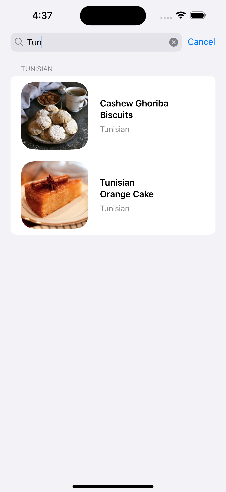

# FetchRecipes
Take Home Project for Fetch

### Summary: Include screen shots or a video of your app highlighting its features

  
  
  
  

### Focus Areas: What specific areas of the project did you prioritize? Why did you choose to focus on these areas?

* Clean Architecture & SOLID Principles

  * Because this is a staff level position, I prioritized MVVM, clean architecture, and SOLID principles over UI polish.
  * Implemented clear layering and separation of concerns
  * Focused on creating a maintainable, scalable foundation that can be expanded upon and easily followed by other developers.

* Dependency Management & Testability

  * Employed protocol-based design (dependency inversion) and dependency injection
  * These architectural decisions significantly simplified unit testing and mock creation
  * Created clear boundaries that enable easy testing of individual components
 
* Image Handling System

As the assignment's primary technical challenge, this showcases my understanding of:

  * Actor-based concurrency
  * Efficient caching patterns
  * Task management and cancellation
  * Request deduplication

### Time Spent: Approximately how long did you spend working on this project? How did you allocate your time?
~10 hours.
* Initial Setup & Architecture - networking layer, respoitory pattern, model creation (2.5 hours) 
* Core Functionality - image caching, recipe service, search, sectioning (3 hours)
* UI - RecipeView, Card Design, Error States, Loading States, Pull to Refresh (2.5 hours)
* Testing - Unit test implementation, bug fixes, cleanup (2 hours)

### Trade-offs and Decisions: Did you make any significant trade-offs in your approach?
* Recipe Data Persistence
    * Chose to keep recipes in memory rather than implementing CoreData persistence.
    * Trade-off: Without server-side change notifications or ETags, implementing persistence would require building a custom cache invalidation strategy.
    * For this scope, the added complexity of managing stale data outweighed the benefits of offline access.

### Weakest Part of the Project: What do you think is the weakest part of your project?
There are some edge cases I decided not address due to time constraints.
* cache eviction and size limits
* Slow conection timeouts
* Device Orientation
* Mac support (but it does work on iPad and appleTV!)

### Additional Information: Is there anything else we should know? Feel free to share any insights or constraints you encountered.
* You can filter by recipe name OR cusine.
* Task for downloading an images is cancelled if the recipe card is quickly moved off screen.
* If one recipe has the same imageURL as another recipe, only one reqest is made.
* Saving images to .cache directory using FileManager.
* Created Endpoint enum for easily switching between the Empty, Malformed, and GoodPath endpoints.
  * If you want to switch between the endpoints, go to DefaultRecipeRepository.swift and inject .recipesMalformed or .recipesEmpty in the initializer instead of .fetchAllRecipes
  * .recipesEmpty and .recipesMalformed are only available in DEBGUG to prevent accidental use in production.

